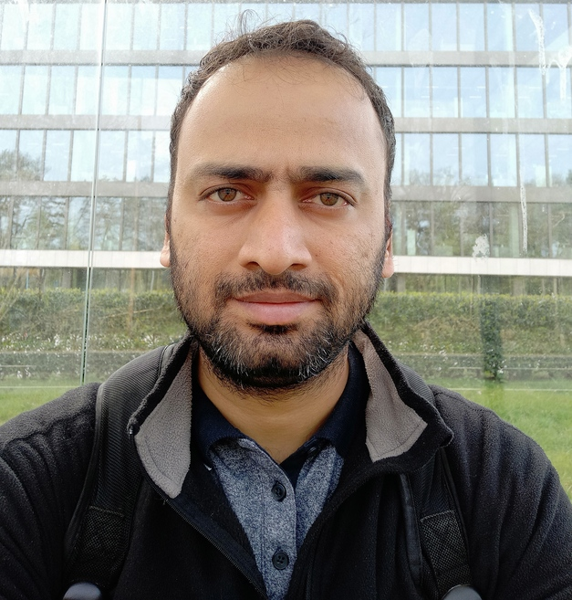

::: main

# About
{style="float:right; width:150px; padding:2px; border-radius:10%"}
I am a researcher with more than twelve years of experience in automated reasoning and system software development. My broad research focus is on solving software engineering problems through learning and logic.

I did my Ph.D. under the guidance of [Deepak D'Souza] at IISc. During my Ph.D., I worked on synthesis of program proofs that help in formal verification of programs using abduction and SMT solving ([thesis]). I was fortunate to have closely collaborated with [Kumar Madhukar] and [Grigory Fedyukovich] during this period. I did my master's from Chennai Mathematical Institute, where my thesis was done under [Mandayam Srivas]. Long before that, I was a network-based storage system developer at NetApp for five years.

You may contact me at: { width=30% }

[TCS Research]:https://www.tcs.com/designing-complex-intelligent-systems
[thesis]:https://etd.iisc.ac.in/handle/2005/6338
[Deepak D'Souza]:https://www.csa.iisc.ac.in/~deepakd/
[Kumar Madhukar]:;https://kumarmadhukar.github.io/
[Grigory Fedyukovich]:http://www.cs.fsu.edu/~grigory/
[Mandayam Srivas]:https://www.cmi.ac.in/~mksrivas/

# Publications

Please refer to [dblp](https://dblp.uni-trier.de/pid/206/6798-1.html) for the latest papers.

||||
|:---|:----------|--------|
| TACAS 2024 | Weakest Precondition Inference for Non-Deterministic Linear Array Programs ([artifact](https://figshare.com/articles/code/Artifact_for_the_Paper_Titled_Weakest_Precondition_Inference_for_Non-Deterministic_Linear_Array_Programs_To_Appear_in_TACAS_2024_/24923517?file=43867506)) | **Sumanth Prabhu**, Deepak D'Souza, Supratik Chakraborty, R. Venkatesh, Grigory Fedyukovich|
| ESOP 2024 | Maximal Quantified Precondition Synthesis for Linear Array Loops ([artifact](https://figshare.com/articles/software/Artifact_for_the_paper_titled_Maximal_Quantified_Precondition_Synthesis_for_Linear_Array_Loops_to_appear_in_ESOP_2024/24945996))| **Sumanth Prabhu**, Grigory Fedyukovich, Deepak D'Souza|
| ATVA 2023 | Automated Property Directed Self Composition| Akshatha Shenoy, Sumanth Prabhu S, Kumar Madhukar, Ron Shemer, Mandayam K. Srivas|
| PLDI 2021 (**Distinguished Paper**) | Specification Synthesis with Constrained Horn Clauses ([tool](https://github.com/freqhorn/hornspec), [blog](https://blog.sigplan.org/2021/09/02/specification-synthesis-with-constrained-horn-clauses/)) | **Sumanth Prabhu**, Grigory Fedyukovich, Kumar Madhukar, Deepak D'Souza|
| ICSE (NIER) 2020 | Using hypersafety verification for proving correctness of programming assignments | Jude K. Anil, **Sumanth Prabhu**, Kumar Madhukar, R. Venkatesh|
| CAV 2019 | Quantified Invariants via Syntax-Guided Synthesis ([tool](https://github.com/freqhorn/freqhorn)) | Grigory Fedyukovich, **Sumanth Prabhu**, Kumar Madhukar, Aarti Gupta|
| FMCAD 2018 | Solving Constrained Horn Clauses Using Syntax and Data ([tool](https://github.com/freqhorn/freqhorn)) | Grigory Fedyukovich, **Sumanth Prabhu**, Kumar Madhukar, Aarti Gupta|
|SAS 2018 |Efficiently Learning Safety Proofs from Appearance as well as Behaviours ([tool](https://github.com/freqhorn/freqhorn)) | **Sumanth Prabhu**, Kumar Madhukar, R. Venkatesh|
|TACAS 2018|VeriAbs: Verification by Abstraction and Test Generation - (Competition Contribution)|Priyanka Darke, **Sumanth Prabhu**, Bharti Chimdyalwar, Avriti Chauhan, Shrawan Kumar, Animesh Basak Chowdhury, R. Venkatesh, Advaita Datar, Raveendra Kumar Medicherla|
|ATVA 2017| Concurrent Program Verification with Invariant-Guided Underapproximation ([tool](https://github.com/sumanthsprabhu/atva_tool)) | **Sumanth Prabhu**, Peter Schrammel, Mandayam K. Srivas, Michael Tautschnig, Anand Yeolekar|

# Activities
* PC of [ATVA 2025](https://conf.researchr.org/track/atva-2025/atva-2025-research-papers)
* Keynote talk at [ISEC 2025](https://conf.researchr.org/track/isec-2025/isec-2025-keynote)
* Invited talk at [CMI](https://www.cmi.ac.in/activities/show-abstract.php?absyear=2024&absref=175&abstype=sem)
* Invited talk at [VSS](https://www.youtube.com/watch?v=wxcxSWS0K3o)
* A lecture on CHCs as part of [Logic](https://www.csa.iisc.ac.in/~deepakd/logic-2021/) course at IISc
* (Sub-)Reviewer: FASE24, FMCAD23, CAV22, FSTTCS22, FMCAD21, TACAS22 AEC, PLDI21 AEC
* Talks: PLDI21; FMCAD20; FSTTCS20,23; SAS18; TACAS24; ESOP24; FMUpdate18,19,21; SAT-SMT School22

# Miscellaneous Experiments
* [MLIR and Deep Learning Compiler](https://github.com/sumanthsprabhu/matmul)
* [Reinforcement Learning for Counterexample](https://github.com/sumanthsprabhu/learncex)
* [Sudoku](https://github.com/sumanthsprabhu/sudoku)
* [Haskell](https://github.com/sumanthsprabhu/Haskell)

::: 

::: footer
The layout and colors are inspired by [this] site. Generated from markdown using [pandoc].

[this]:https://www.cs.princeton.edu/~zkincaid/
[pandoc]:https://pandoc.org/

:::
